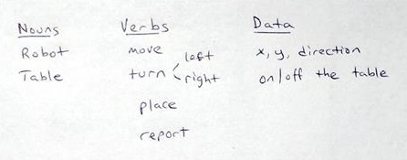
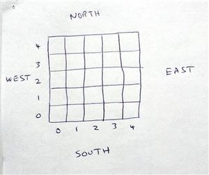
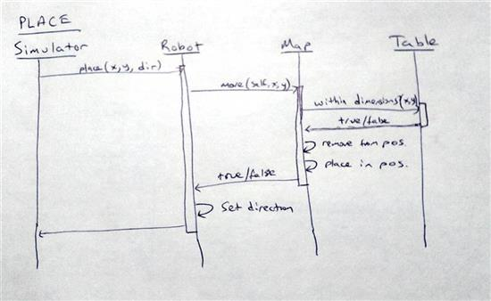
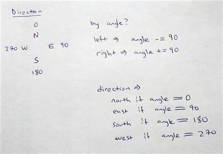

# Toy Robot Simulator

This application simulates a toy robot moving around a square tabletop. Input is provided through a file and output printed to the console.

This project has been written to specifications defined in [REQUIREMENTS.md](REQUIREMENTS.md) which defines the problem space, use cases, input and output format and the deliverables. Please read it first to be familiar with the requirements and understand the scope of the work being done here.


## Installation

The code in this project is written in the Ruby programming language. It is provided in source format, without a compiled executable, so you will need to have a Ruby interpreter available in order to run the code.

Ruby can be installed on most platforms. You can check if you have a ruby interpreter installed, and what version it is by typing the following command in a console window (ignore the $ at the beginning, it indicates a command prompt - yours might be different):

```
$ ruby -v
```

If you need to install Ruby see below for instructions.

This code has been tested using Ruby version 2.2.2 running on Ubuntu 14.04.

### Instructions

1. Install Ruby
  - See [instructions](https://www.ruby-lang.org/en/documentation/installation/) on ruby-lang.org
2. Install Bundler
  - See [instructions](http://bundler.io/) on bundler.io
  - It may be as simple as typing `gem install bundler`
3. Clone this repository on your development machine:
  - Cloning means making a copy of a remote repository on your local machine so you can work with it. You don't make any changes to the original repository by cloning, unless you edit some files, _commit_ your changes, and _push_ those changes.
  - Cd to the directory you want to place the files under. To place them in a folder under your home directory: `cd ~`
  - Type `git clone git@github.com:lessan/toyrobot.git`
  - See [instructions](https://help.github.com/articles/cloning-a-repository/) on github.com for more details about cloning a repository.
4. Install required gems:
  - Cd to the toyrobot directory: `cd ~/toyrobot`
  - Type `bundle install`
  - This will download and install all the gems required for this project.


## Usage

### Input

The simulator reads input from a [file](data/commands.txt) called `commands.txt` in the `data` directory. If you would like to change the sequence of commands, edit that file. Extra whitespace before or after the commands will be ignored. A sample of the contents of this file would be:

```
PLACE 0,0,NORTH
LEFT
REPORT
```

### Command Reference

Commands and arguments are not case sensitive - any combination of upper and lower case characters will work. For example, the following are equivalent:
```
MOVE
move
Move
mOvE
```

Each command must be separated from the next by a newline character. This can be either `\n`, `\r`, or `\r\n`. Simply pressing ENTER between commands in any editor or browser window will add an acceptable newline.

The table is divided into a square grid of 5 sections on each side:

**4** |       |       |       |       |       |
------|-------|-------|-------|-------|-------|
**3** |       |       |       |       |       |
**2** |       |       |       |       |       |
**1** |       |       |       |       |       |
**0** |       |       |       |       |       |
      | **0** | **1** | **2** | **3** | **4** |

If a command results in the Robot being place outside the table or moving off the table then it will be silently ignored.

Valid commands are:

Command | Arguments | Description
------- | --------- | -----------
PLACE   | X, Y, DIR | Place the Robot on the table at the initial position indicated by X and Y, and facing in the direction DIR. Valid positions are 0 to 5 for both X and Y. Valid directions are NORTH, SOUTH, EAST and WEST. Arguments must be separated from the PLACE command by one or more spaces, and separated from each other by a comma (spaces around them will be ignored).
MOVE    |           | Move the Robot one cell forward in the direction it was facing.
LEFT    |           | Turn the Robot 90 degrees counter-clockwise. For example if it was facing NORTH it would now be facing WEST.
RIGHT   |           | Turn the Robot 90 degrees clockwise. For example if it was facing NORTH it would now be facing EAST.
REPORT  |           | A message describing the current status of the Robot (its position and direction) will be printed to standard output (i.e. the console window). For example: `Output: 1, 1, NORTH`.

Invalid commands will be silently ignored.

Any commands before the first PLACE command will be silently ignored.

The PLACE command can be issued more than once; on subsequent times it will re-position the Robot. All other commands can also be issued multiple times.

### Running the Simulator

To run the simulator, invoke the default rake task:

```
$ cd ~/toyrobot
$ bundle exec rake
```

This will load the input file, process the commands and print the result of any REPORT commands out to the console. You should see the following output (the details may vary depending on the contents of your command.txt file):

```
Robot Simulator
---------------
Reading input from commands.txt:
    PLACE 0,0,NORTH
    LEFT
    REPORT
Processing input through the Robot Simulator...
    Output: 0, 0, WEST
Simulation ended.
```


## Testing

Most of the code is covered by Unit and Integration tests which are located in the `spec` directory and are written using [RSpec](http://rspec.info/).

Read through these tests to understand how the code works.
The convention is to first cover the happy path: the intended functionality of the code under normal circumstances, and then to address the various sad paths: edge and error cases.
It is impossible or impractical to cover every possible scenario, but the most likely and those with the most impact are covered.
Certain sections of the code are covered in more detail than others due to their complexity and the risk involved in something going wrong there.
For example, the Rake task which loads the input from a file and invokes the simulator is not covered by any tests, whereas the Robot class is fully covered.

To run the entire test suite:

```
$ cd ~/toyrobot
$ bundle exec rspec
```

To run all the tests in one file:

```
$ cd ~/toyrobot
$ bundle exec rspec ./spec/robot_simulator_spec.rb
```

To run a single test case, specify the line number on which it occurs. For example, to run the test whose definition starts at line 10:

```
$ cd ~/toyrobot
$ bundle exec rspec ./spec/robot_simulator_spec.rb:10
```


## Design

In this section I discuss the design of this application and the decisions that were made along the way.
It should prove helpful for reviewing the code, for modifying it or extending it in future and may also prove helpful for others working on a similar application.

#### Steps to getting started
1. Read [REQUIREMENTS.md](REQUIREMENTS.md)
2. Make notes of central concepts: nouns, verbs and the data that is exchanged:<br />
   
3. Draw a table with a numbered 5x5 grid and compass directions:<br />
   
4. Sketch several sequence diagrams to better understand the messages that get passed between objects. Here's a sample:<br />
   
5. Consider how I would implement key methods, to see if there would be any repercussions on the design:<br />
    
6. Create a skeleton project and upload it to this repository
7. Start implementing classes using an outside-in approach: Rakefile, then Simulator, then CommandParser, etc.

#### Steps for implementing each object
1. The implementation starts with me having a an idea of the responsibility for this object (what it does)
2. I then think about how I would implement this, possibly writing a spike in a throw-away test
3. Once I have an idea of how I would implement it and its public interface (methods and return values), I fill out the spec file with tests, starting with the happy path (when things go the way they should) and adding pending tests for sad paths as I think of them, later implementing the pending tests
4. Once I have a few tests, I start implementing the methods to pass the tests, then Red-Green-Refactor


## License
This project is licensed under the MIT License. See the [LICENSE.md](LICENSE.md) file for your rights and limitations.


## Contributing


